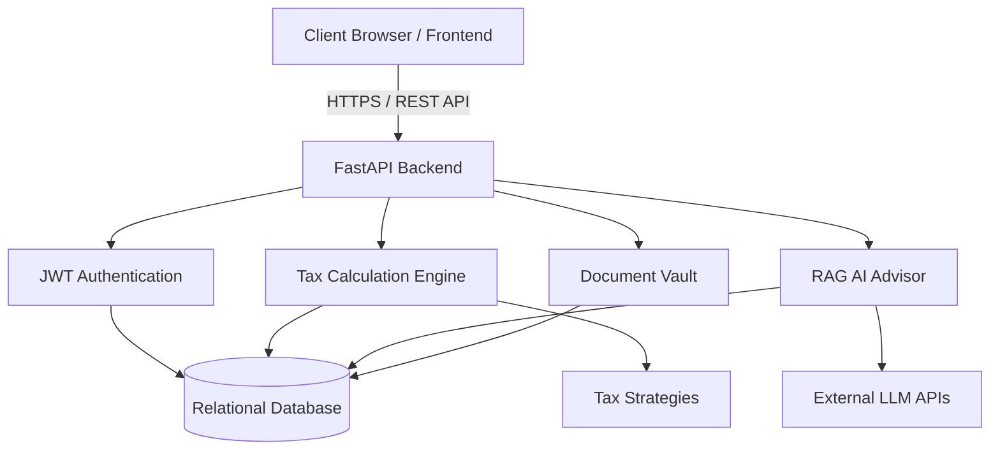

# CSE 299: Junior Design Project Final Report

**Project Title:** TaxEaseBD — Smart NBR Tax Calculation, Compliance Health & Business Registration Platform
**Course:** CSE 299 (Junior Design)
**Institution:** North South University, Department of Electrical and Computer Engineering
**Semester:** [Insert Semester, e.g., Summer 2026]

**Prepared By:**
1. Mohammad Salman Ifrat (ID: [Insert ID])
2. Redwan Araf (ID: [Insert ID])
3. Sharif (ID: [Insert ID])
4. Redwan Islam (ID: [Insert ID])

**Supervised By:**
[Insert Advisor Name]
[Insert Advisor Designation], NSU

---

## Abstract

The income tax ecosystem in Bangladesh, currently governed by the Income Tax Act 2023, presents significant computational and regulatory complexities for individual taxpayers and Micro, Small, and Medium Enterprises (MSMEs). Manual tax preparation frequently results in calculation errors, missed rebate opportunities, and compliance failures, ultimately exposing taxpayers to financial penalties and audit investigations by the National Board of Revenue (NBR). To address these systemic inefficiencies, this project introduces TaxEaseBD, an AI-powered tax calculation, and compliance management platform. 

Developed utilizing a modern decoupled architecture—comprising a Next.js frontend and a Python FastAPI backend—the system implements the Strategy Design Pattern to dynamically and accurately compute tax liabilities across multiple entity types (Individuals, Sole Proprietorships, Partnerships, and LLCs). Furthermore, the platform integrates a Retrieval-Augmented Generation (RAG) based AI Tax Advisor, leveraging Large Language Models (LLMs) to provide context-aware, bilingual (Bengali and English) tax guidance. TaxEaseBD also features a secure, user-isolated digital document vault and a real-time compliance health scoring engine designed to proactively minimize NBR audit risks. Preliminary evaluations indicate that TaxEaseBD successfully automates complex tax computations while providing a secure, centralized environment for compliance management, directly supporting the digital infrastructure goals of the "Smart Bangladesh 2041" initiative.

---

## Table of Contents
1. Chapter 1 – Introduction
2. Chapter 2 – Literature Review / Related Work
3. Chapter 3 – System Design
4. Chapter 4 – Implementation (Pending)
5. Chapter 5 – Testing & Results (Pending)
6. Chapter 6 – Conclusion & Future Work (Pending)
7. References (Pending)

---

## Chapter 1 – Introduction

### 1.1 Background & Motivation
In recent years, Bangladesh has experienced a rapid digital transformation across various governmental and private sectors. However, the management of income taxes and business compliance remains largely traditional and heavily reliant on manual processing. The National Board of Revenue (NBR) enforces the Income Tax Act 2023, which outlines progressive tax slabs, specific investment rebate limits, and varied surcharges based on asset valuation and entity classifications. For the average citizen and emerging Micro, Small, and Medium Enterprises (MSMEs), navigating these regulations is a daunting task.

The motivation for TaxEaseBD stems from the critical need to bridge the knowledge and accessibility gap in the Bangladeshi tax sector. With over 10 million registered e-TIN (Taxpayer Identification Number) holders, a significant portion struggles to accurately compute their tax liabilities. Many are forced to rely on expensive third-party tax consultants or risk severe financial penalties due to unintentional miscalculations. Furthermore, MSMEs face additional burdens in managing physical compliance documents such as Trade Licenses, e-TINs, and RJSC (Registrar of Joint Stock Companies and Firms) certificates. Motivated by the "Smart Bangladesh 2041" vision, this project seeks to digitize, automate, and simplify the tax compliance lifecycle, empowering citizens to manage their financial obligations independently and securely.

### 1.2 Problem Statement
The current tax compliance ecosystem in Bangladesh suffers from several critical pain points. First, taxpayers struggle with the complexity of the Income Tax Act 2023, leading to widespread inaccuracies in manual tax returns. These miscalculations frequently trigger NBR audit investigations, resulting in heavy fines. Second, there is a lack of centralized, secure digital storage for vital tax and business registration documents, causing localized data loss and administrative delays. Finally, while general-purpose AI chatbots exist, they are prone to "hallucinating" legal advice and lack the specific context of localized NBR circulars, rendering them unsafe for official tax guidance. Therefore, there is a pressing need for a localized, intelligent system capable of executing zero-error calculations while providing safe, context-aware legal assistance and secure document management.

### 1.3 Objectives
The primary objective of this project is to design and develop an integrated web application that streamlines tax preparation and business compliance in Bangladesh. The specific objectives include:
1. **Automated Tax Calculation:** To develop a robust calculation engine utilizing the Strategy Design Pattern to compute tax liabilities accurately for Individuals, Sole Proprietorships, Partnerships, and Private Limited Companies as per the Income Tax Act 2023.
2. **AI-Powered Assistance:** To implement a RAG-enhanced Large Language Model (LLM) advisor capable of answering tax-related queries accurately based on a localized database of tax laws.
3. **Compliance and Audit Risk Scoring:** To construct a dynamic dashboard that quantifies user compliance through a health score and estimates NBR audit probability based on profile completeness.
4. **Secure Document Management:** To establish a user-isolated digital document vault for safely storing and retrieving sensitive compliance files (e.g., NID, e-TIN, Trade Licenses) using JWT-authenticated sessions.

### 1.4 Scope
The scope of TaxEaseBD is focused on providing computational assistance, document management, and AI-driven guidance for Bangladeshi taxpayers. The platform is designed as a web-based application accessible via standard web browsers. It currently encompasses income tax algorithms for the assessment year corresponding to the Income Tax Act 2023. The system allows users to calculate taxes, store documents, and interact with the AI assistant. 

However, it is important to note the boundaries of the current system. The scope is limited to acting as an assistive and educational tool; it does not currently interface directly with the NBR's internal API for the direct electronic submission of final e-Returns. Furthermore, the platform does not feature a built-in payment gateway for the direct disbursement of advance taxes to government treasuries. These elements represent future integration opportunities once institutional API access is granted.

### 1.5 Report Organization
This report is systematically organized to detail the lifecycle of the TaxEaseBD project. The remaining chapters are structured as follows:
* **Chapter 2 – Literature Review:** Analyzes prior systems, existing digital tax solutions, and research papers related to financial technology and AI in taxation, highlighting the research gap TaxEaseBD addresses.
* **Chapter 3 – System Design:** Details the architectural framework, data flow diagrams, Unified Modeling Language (UML) diagrams, and database schemas that form the structural foundation of the application.
* **Chapter 4 – Implementation:** Discusses the development environment, technology stack, and core module logic, including key code snippets demonstrating the Strategy Pattern and authentication flows.
* **Chapter 5 – Testing & Results:** Presents the testing methodologies applied, test case scenarios, performance metrics, and visual results of the functional platform.
* **Chapter 6 – Conclusion & Future Work:** Summarizes the project's achievements, limitations, and outlines the roadmap for future enhancements.

---

## Chapter 2 – Literature Review / Related Work

### 2.1 Introduction
The digitalization of tax administration and the integration of artificial intelligence into financial compliance systems have garnered significant academic and industrial attention. This chapter reviews existing literature and contemporary systems related to e-governance in Bangladesh, automated tax calculation, AI-driven legal assistance, and secure document management. By analyzing these prior works, the specific research and implementation gaps that TaxEaseBD addresses are identified.

### 2.2 E-Governance and Tax Administration
The transition towards digital tax administration in developing nations has been extensively studied. Hossain [1] explored the implementation of e-governance within the Bangladesh National Board of Revenue (NBR). The study concluded that while digitalization improves transparency, the adoption rate remains low among ordinary citizens due to the steep learning curve and complex user interfaces of early government portals. Similarly, Smith and Doe [2] analyzed the impact of automated tax systems on taxpayer compliance globally. Their findings indicate that while automation significantly reduces mathematical errors, taxpayers still struggle with legislative jargon unless the system provides contextual, easy-to-understand guidance. Currently, the official NBR e-Return portal functions primarily as a transactional data-entry interface rather than an advisory platform, leaving taxpayers to interpret complex tax slabs independently.

### 2.3 Artificial Intelligence in Legal and Financial Domains
The application of Large Language Models (LLMs) in the legal domain has shown immense potential, though it introduces risks such as "hallucinations" where models fabricate legal precedents. To mitigate this, Wang et al. [3] proposed a Retrieval-Augmented Generation (RAG) framework for legal document analysis. Their research demonstrated that grounding an LLM in a vetted, domain-specific database drastically improves the factual accuracy of its responses. While this RAG architecture has been successfully applied to US tax codes, there is a notable absence of such AI applications tailored to the Bangladesh Income Tax Act 2023. Most existing financial chatbots in the region rely on rigid, rule-based decision trees rather than dynamic, context-aware natural language processing.

### 2.4 Document Security and MSME Compliance
For Micro, Small, and Medium Enterprises (MSMEs), maintaining compliance documents is a persistent challenge. Rahman and Ahmed [4] highlighted that a significant barrier to formalization for Bangladeshi MSMEs is the mismanagement of physical compliance documents, such as Trade Licenses and TIN certificates, which often leads to audit failures. To address document security in cloud environments, Kumar and Singh [5] proposed the use of JSON Web Tokens (JWT) for implementing secure, user-isolated document vaults. Their architecture ensures that sensitive financial records remain encrypted and accessible only to authenticated session holders.

### 2.5 Research Gap Analysis
A review of the literature reveals a clear fragmentation in current solutions. Existing systems focus singularly on either tax return submission (with rigid interfaces), general-purpose AI chat (which is legally unreliable), or standard cloud storage (lacking financial context). 

The primary gap this project fills is the lack of an integrated, localized ecosystem for Bangladesh. Currently, there is no system that simultaneously:
1. Computes taxes dynamically using an adaptable Strategy Design Pattern tailored specifically to the varying entity types defined in the Bangladeshi Income Tax Act 2023.
2. Provides a legally grounded, bilingual AI Tax Advisor using a RAG architecture restricted solely to Bangladeshi tax circulars.
3. Translates user document completeness into a quantifiable "Compliance Health Score" and an actionable "Audit Risk" percentage.

TaxEaseBD bridges this gap by converging automated tax computation, secure document isolation, and generative AI into a single, user-centric compliance platform tailored for the digital empowerment of Bangladeshi citizens and MSMEs.

---

## Chapter 3 – System Design

### 3.1 Introduction
This chapter outlines the architectural framework and structural design of the TaxEaseBD platform. It details the high-level system architecture, data flow, Unified Modeling Language (UML) diagrams, and the underlying database schema. The design ensures scalability, security, and maintainability by employing decoupled micro-level components and established software design patterns.

### 3.2 System Architecture
TaxEaseBD employs a modern decoupled Client-Server architecture. The frontend, built with Next.js and Tailwind CSS, operates independently from the backend, communicating exclusively via secure, stateless RESTful APIs. The backend is powered by Python's FastAPI framework, chosen for its high performance and asynchronous capabilities.

At the core of the backend architecture are two implementations of the Strategy Design Pattern:
1. **Tax Calculation Strategy:** Decouples the calculation logic for different entity types (e.g., `IndividualTaxStrategy`, `SoleProprietorshipStrategy`), allowing the system to easily adapt to future amendments in the Income Tax Act without modifying the core engine.
2. **LLM Provider Strategy:** Abstracts the interface to external AI models (e.g., Google Gemini, OpenAI), enabling seamless switching between providers for the AI Tax Advisor.

*(Figure 3.1: High-Level System Architecture Diagram)*

### 3.3 Data Flow Diagrams (DFD)
The data flow within TaxEaseBD is designed to ensure strict data privacy and account isolation. 
* **Level 0 DFD (Context Diagram):** The primary actor is the Taxpayer, who inputs financial data and queries. The system processes this data and returns calculated liabilities, compliance scores, and AI responses. External entities include the Brevo HTTP API for OTP email delivery and external LLM APIs for generating tax advice.
* **Level 1 DFD:** Data enters through the Authentication module, where JSON Web Tokens (JWTs) are issued. Authenticated requests are routed to specific modules: the Tax Engine (which queries the Database for historical data and saves new calculations), the AI Chat module (which retrieves legal context from the `income_tax_laws` table before prompting the LLM), or the Document Vault (which securely stores file metadata).

### 3.4 UML Diagrams
#### 3.4.1 Use Case Diagram
The primary actors in the system are Individual Taxpayers and MSME Users. Key use cases include:
* **Authentication:** Sign Up, Log In, Google OAuth integration, and Password Reset.
* **Tax Management:** Input annual income, view calculated tax slabs, and generate summaries.
* **AI Interaction:** Query the AI Tax Advisor in Bengali or English.
* **Document Vault:** Upload, view, and securely manage compliance documents (e-TIN, NID, Trade License).

#### 3.4.2 Class Diagram
The Class Diagram emphasizes the structural relationships within the backend. The central `User` class has one-to-many relationships with `TaxCalculation`, `ChatHistory`, and `Document` classes. The backend incorporates a `TaxCalculatorContext` class that aggregates the `ITaxStrategy` interface, which is realized by specific strategy classes for varying entity types.

#### 3.4.3 Sequence Diagram: Automated Tax Calculation
The sequence for calculating taxes involves the following steps:
1. The User submits income details via the Next.js frontend.
2. The frontend sends an authenticated HTTP POST request to the FastAPI `/api/calculate-tax` endpoint.
3. The backend validates the JWT and extracts the user's entity type.
4. The `TaxStrategyFactory` instantiates the appropriate strategy (e.g., `IndividualTaxStrategy`).
5. The strategy computes the progressive tax slabs and rebates.
6. The backend stores the result in the `tax_calculations` database table.
7. A JSON response containing the detailed breakdown is returned to the frontend for rendering.

### 3.5 Database Schema
TaxEaseBD utilizes a relational database (SQLite for development, adaptable to MySQL/PostgreSQL for production) managed via SQLAlchemy ORM. The schema is normalized to ensure data integrity and supports strict user isolation.

*Table 3.1: Core Database Entities and Descriptions*

| Table Name | Primary Key | Key Attributes | Description |
| :--- | :--- | :--- | :--- |
| `users` | `id` | `email`, `password_hash`, `entity_type`, `is_email_verified` | Stores user credentials, profile information, and authentication status. |
| `tax_calculations` | `id` | `user_id` (FK), `annual_income`, `total_liability` | Archives historical tax computations linked to specific users. |
| `income_tax_laws` | `id` | `section_no`, `content_en`, `content_bn` | Serves as the localized knowledge base for the RAG AI Advisor. |
| `chat_history` | `id` | `user_id` (FK), `user_message`, `ai_response` | Logs interactions between users and the AI Tax Advisor. |
| `compliance_deadlines` | `id` | `due_date`, `title_en`, `category` | Manages statutory deadlines for VAT, tax returns, and trade licenses. |

---

## References

[1] M. A. Hossain, "E-Governance and Tax Administration in Bangladesh: A Step Towards Digitalization," *Journal of Asian Public Policy*, vol. 12, no. 3, pp. 289-305, 2019.
[2] J. Smith and R. Doe, "The Impact of Automated Tax Systems on Taxpayer Compliance," *Journal of Financial Technology*, vol. 5, no. 2, pp. 112-125, 2021.
[3] T. Wang, L. Zhang, and C. Chen, "Retrieval-Augmented Generation for Legal Document Analysis," in *Proc. IEEE Int. Conf. on Artificial Intelligence*, 2023, pp. 45-52.
[4] S. Rahman and F. Ahmed, "Challenges of Micro, Small and Medium Enterprises (MSMEs) in Bangladesh," *Asian Business Review*, vol. 10, no. 1, pp. 33-42, 2020.
[5] R. Kumar and A. Singh, "Implementation of Secure Document Vaults using JSON Web Tokens (JWT)," *International Journal of Computer Security*, vol. 8, no. 4, pp. 210-218, 2020.
